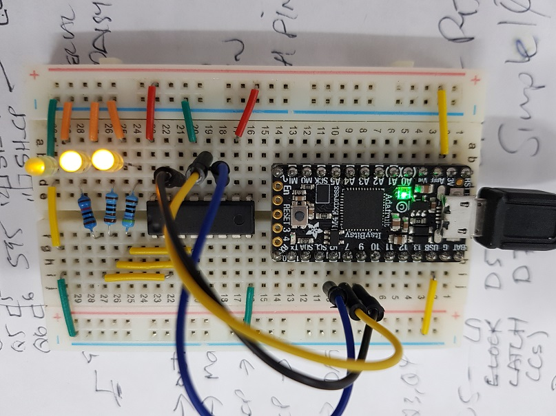
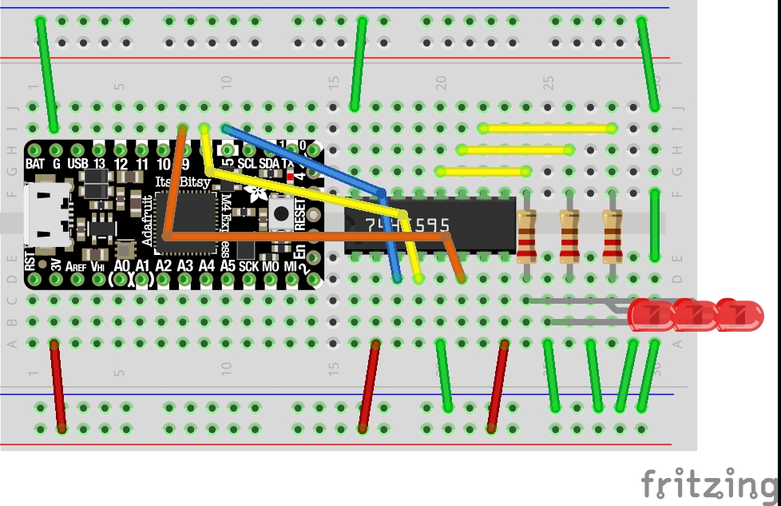

#CMOS 74HC595 on CircuitPython

Example of using a cmos 74HC595 8x channel PISO chip with CircuitPython.  I only connected 3x outputs in this example but there is 8x outputs available per chip with the ability to daisy more chips together.

